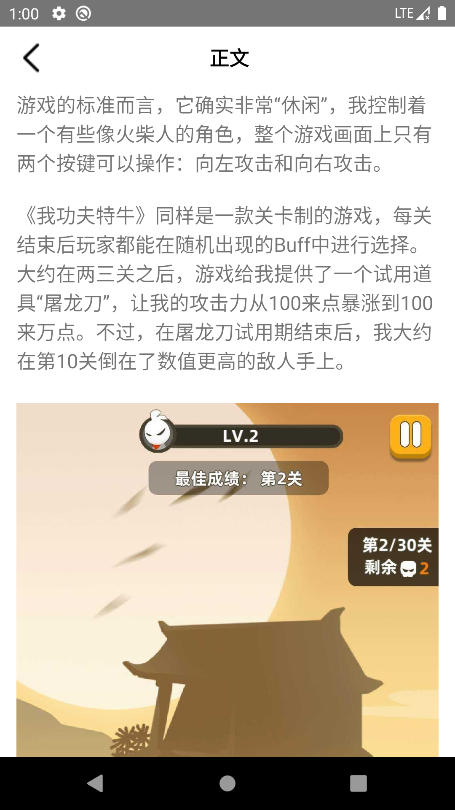
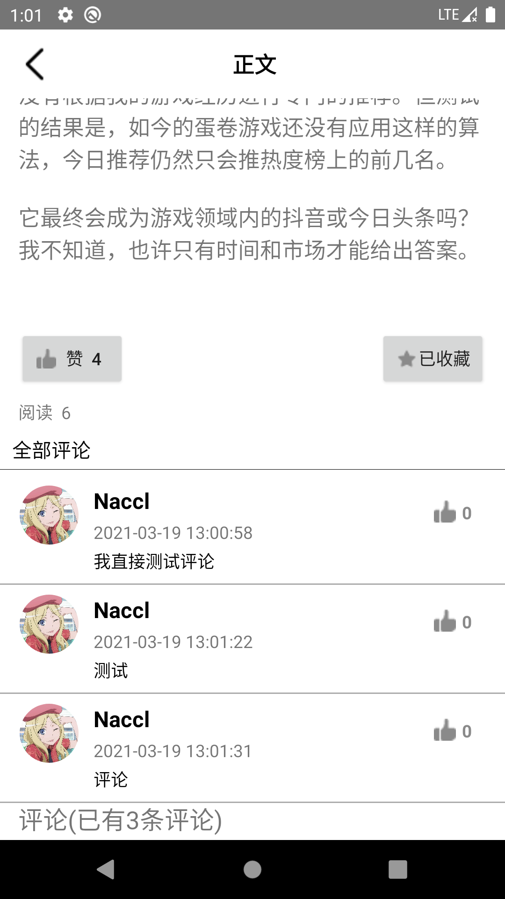
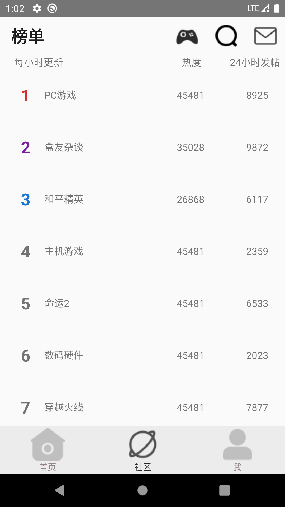
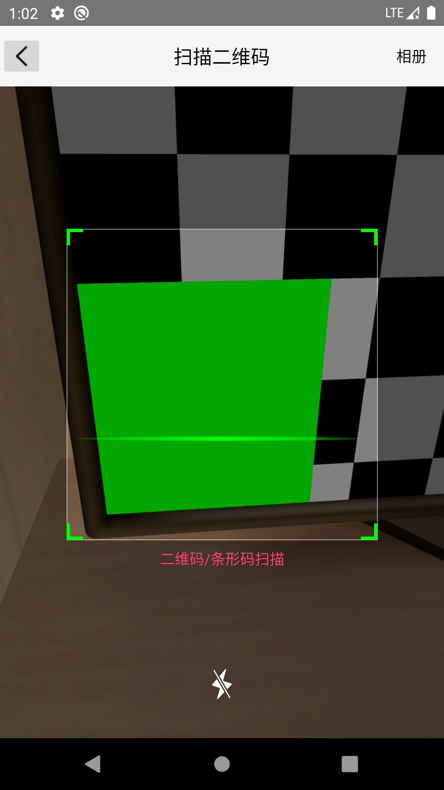
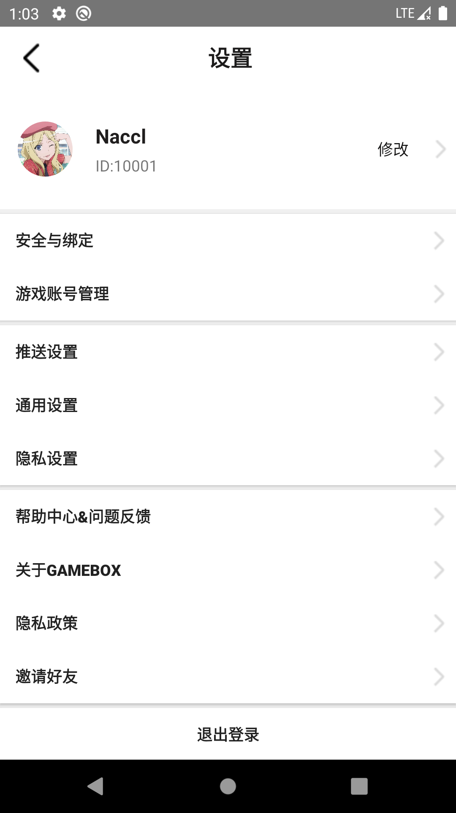
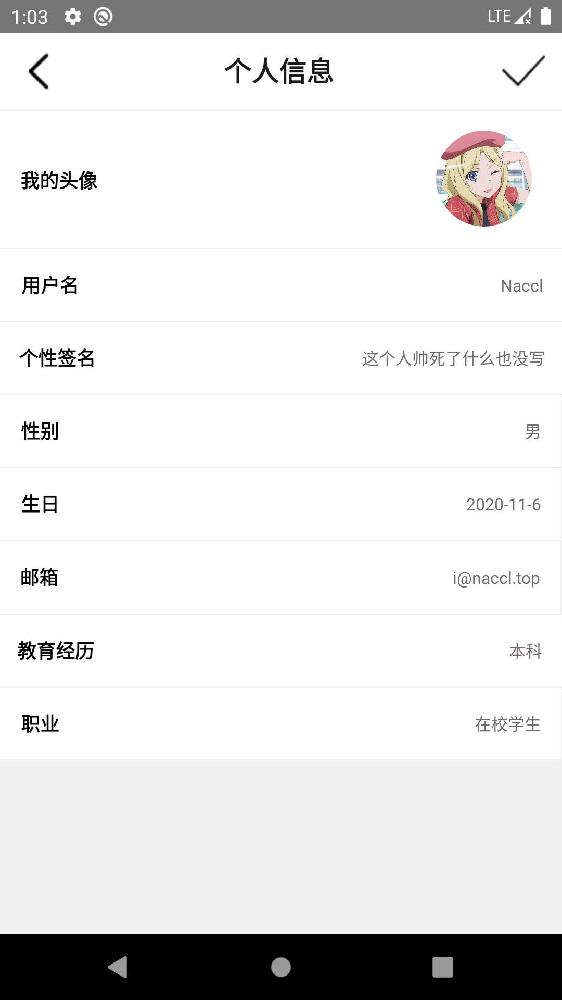
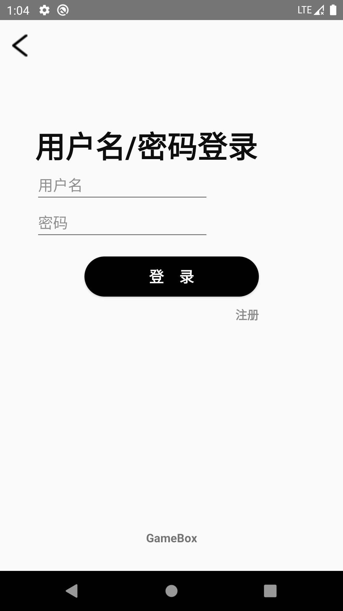

## Features

仿[小黑盒](https://www.xiaoheihe.cn/)安卓APP，含界面原型设计、最新资讯爬虫

主要实现功能：

1. 爬取[触乐网](http://www.chuapp.com/)最新游戏资讯
2. 登录注册
3. jwt 实现登录状态鉴权
4. 首页文章布局
5. 上拉加载更多
6. 文章 HTML 渲染
7. 文章配图从网络动态获取
8. 本地 SQLite 缓存查看过的文章和图片资源
9. 文章点赞收藏
10. 个人资料修改

##后端

1. 核心框架：[Spring Boot](https://github.com/spring-projects/spring-boot)
2. Token 认证：[jjwt](https://github.com/jwtk/jjwt)
3. 持久层框架：[MyBatis](https://github.com/mybatis/spring-boot-starter)
4. 分页插件：[PageHelper](https://github.com/pagehelper/Mybatis-PageHelper)
5. JSON 库：[fastjson](https://github.com/alibaba/fastjson)

## Android端

1. 网络请求框架：[okhttp3](https://github.com/square/okhttp)
2. JSON 库：[fastjson](https://github.com/alibaba/fastjson)
3. 下拉刷新、上拉加载：[SmartRefreshLayout](https://github.com/scwang90/SmartRefreshLayout)
4. 二维码：[zxing](https://github.com/zxing/zxing)
5. 数据库缓存：[SQLite](https://www.sqlite.org/)

## Screenshots

